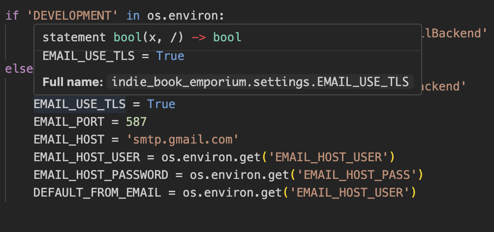

# book_store
# Indie Book Emporium

Welcome to the **Indie Book Emporium**, your gateway to a world of undiscovered literary gems. Our e-commerce platform specializes in offering unique, captivating books from lesser-known publishers and writers, providing avid readers with access to titles not found in mainstream bookstores.

## Why Choose Indie Book Emporium?

At Indie Book Emporium, we believe in the power of storytelling and the magic of books that might not have a home on the shelves of larger retailers. Our selection includes a variety of alternative titles across genres, ensuring that there’s something intriguing for every reader.

## Community and Events

In addition to our diverse book collection, we are proud to host storytelling events for children, fostering a love for reading in the next generation and creating community ties through the joy of stories.

---

Join us in exploring the world of indie books, enhancing your reading experience, and discovering your next favorite author!


# Table of Contents

- [Store-Goals] (#store-goals)

## Store Goals

### Indie Book Emporium is designed to achieve the following

- Establish **Indie Book Emporium** as a leading online destination for alternative and independently published books.

- Build a loyal customer base through, excellent customer service, quality products

- Continually expand the inventory to include a wider range of books from Independent publishers and lesser-known authors

- Boost overall sales through effective marketing and promotions

- Penetrate niche markets by targeting specific demographics interested in alternative and indie literature

- Increase user engagement through interactive features such as reviews, forums, social media

### Customer Goals

- Customers aim to find unique, lesser-known books that aren't available in mainstream bookstores.

- Customers expect the website to be easy to navigate, search, and make purchases with minimal hassle.

- Customers seek comprehensive information about the books, including detailed descriptions, author biographies, to make informed decisions.

- Customers want fast and reliable delivery options that ensure their books arrive in good condition and on time.

- Customers need a secure and straightforward checkout process to safeguard their personal and payment information.

## User Stories

### Viewing and Navigation
- As a visitor, I want to easily understand the main purpose of the Indie Book Emporium, so I can decide if I want to explore their book collection.
- As a customer, I want to easily navigate the website from any device (mobile/tablet/desktop), so I can access the bookstore anywhere.
- As a user, I want to see highlighted categories (e.g., new arrivals, most popular, staff picks) on the homepage, so I can quickly browse books that might interest me.
- As a user, I want to access detailed information about each book, including description, author, publication date, to help me make better purchasing decisions.

### Registration and User Accounts
- As a new user, I want to register for an account easily using my email address, so I can manage my purchases and receive updates.
- As a user, I want to log in to my account with a username and password, so that I can access my personal settings and history.
- As an account holder, I want to be able to reset my password if I forget it, to ensure I can regain access to my account.
- As a registered user, I want to be able to view my past orders and their statuses, so I can track what I have bought and when.

### Sorting and Searching
- As a user, I want to search for books by title, author, or keyword, so that I can find specific items I'm interested in.
- As a user, I want to filter search results by genre and price to find books that meet my criteria.

### Purchasing and Checkout
- As a customer, I want to add books to my cart easily from any listing or book detail page, so I can continue shopping without interruptions.
- As a customer, I want to view and modify the contents of my shopping cart, including quantities or removing items, before proceeding to checkout.
- As a customer, I want to check out through a simple, secure process, so I can confidently make purchases.
- As a customer, I want to receive a confirmation email after I make a purchase, so I can be sure my order has been processed.

### Database Schema (ERD)
[Database Schema](./test-images/db-schema.png)

## Technologies Used
### Languages

- [Python](https://www.python.org/) - Used for adding functionality to the application.
- [HTML5](https://en.wikipedia.org/wiki/HTML) - Provides the content and structure for the website.
- [CSS3](https://en.wikipedia.org/wiki/CSS) - Provides the styling for the website.
- [JavaScript](https://en.wikipedia.org/wiki/JavaScript) - Provides interactive elements of the website

### Frameworks and Software

- [Bootstrap](https://getbootstrap.com/) - A CSS framework that helps building solid, responsive, mobile-first sites.
- [Django](https://www.djangoproject.com/) - An MVT framework used to create the Tennis Buddies site.
- [Balsamiq](https://balsamiq.com/) - Used to create wireframes.
- [Github](https://github.com/) - Used for hosting the repository.
- [Projects in GitHub](https://github.com/DomGambarini) - Used for project managament.
- [Heroku](https://heroku.com/) - Used for deploying the application.
- [Markdown Table Generator](https://www.tablesgenerator.com/markdown_tables) - Used to generate tables in Markdown.
- [Favicon Converter](https://favicon.io/favicon-converter/) - used to create a favicon in correct format.
- [Lighthouse](https://developer.chrome.com/docs/lighthouse/overview/) - Used to test performance of site.
- [Responsive Design Checker](https://www.responsivedesignchecker.com/) - Used for responsiveness check.
- [Google Chrome DevTools](https://developer.chrome.com/docs/devtools/) - Used for debugginf and responsiveness testing.
- [HTML Validation](https://validator.w3.org/) - Used to validate HTML code
- [CSS Validation](https://jigsaw.w3.org/css-validator/) - Used to validate CSS code
- [CI Python Linter](https://pep8ci.herokuapp.com/#) - Used for validation python code.
- [Lucid Charts](https://lucidchart.com/) - for creating my ERD Diagram
- [AWS](https://aws.amazon.com/) - used for holding images and email sending sfunctionality
- [Stripe](https://stripe.com/en-cz) - used for providing a payment method to the store


### Python Packages
- asgiref==3.8.0
- boto3==1.34.77
- botocore==1.34.77
- certifi==2024.2.2
- cffi==1.16.0
- charset-normalizer==3.3.2
- cryptography==42.0.5
- defusedxml==0.7.1
- dj-database-url==0.5.0
- Django==3.2.25
- django-allauth==0.61.1
- django-countries==7.2.1
- django-crispy-forms==1.14.0
- django-storages==1.14.2
- gunicorn==21.2.0
- idna==3.6
- jmespath==1.0.1
- oauthlib==3.2.2
- packaging==24.0
- pillow==10.2.0
- psycopg2==2.9.9
- pycparser==2.21
- PyJWT==2.8.0
- python-dateutil==2.9.0.post0
- python-dotenv==1.0.1
- python3-openid==3.2.0
- pytz==2024.1
- requests==2.31.0
- requests-oauthlib==1.4.0
- s3transfer==0.10.1
- setuptools==69.2.0
- six==1.16.0
- sqlparse==0.4.4
- stripe==8.9.0
- typing_extensions==4.10.0
- urllib3==2.2.1


## Project Deployment

- To set up Django along with the necessary libraries, execute the following commands:

  * `pip3 install 'django<4' gunicorn`
  * `pip3 install dj_database_url psycopg2`

- Following the installation, generate a requirements file:

  * `pip3 freeze --local > requirements.txt` - This command captures and lists the installed libraries in `requirements.txt`.

- Proceed to create your project:

  * `django-admin startproject YOUR_PROJECT_NAME .` - Initiates your Django project.

- Next, establish your application within the project:

  * `django-admin startapp APP_NAME` - This command creates your application.

- To set up a superuser, enter the following command:
  `python3 manage.py createsuperuser`

  You'll be prompted to enter user details to complete the superuser setup.

- It's time to integrate the application in your project’s `settings.py` file:

- Proceed with the initial migration and start the server to ensure everything is operational. Use these commands:

  * `python3 manage.py migrate` - Applies database migrations.
  * `python3 manage.py runserver` - Starts the development server. To verify, use the 'open browser' button shown post command execution.

- Create an `env.py` file at the root level and include the necessary environment variables. Ensure this file is listed in your `.gitignore` to protect sensitive data:

  ```python
  import os

  os.environ["DATABASE_URL"] = "insert your own ElephantSQL database URL here"
  os.environ["SECRET_KEY"] = "enter a random secret key here"


## ElephantSQL Database

[ElephantSQL](https://www.elephantsql.com/) is used for the PostgreSQL database in this project.

To create your own PostgreSQL database, sign-up with your GitHub account and follow these steps:
- Click **Create New Instance** to initiate a new database.
- Choose a name, usually the name of the project.
- Select **Tiny Turtle (Free)** plan.
- Leave the **Tags** blank.
- Select **Region** and **Data Center** closest to you.
- Afterwards, click on the new database name, where you can view the db URL and Password. Copy the URL and enter the address into your **config vars in Heroku** and into your `env.py` file.

[Back to top](#contents)
## Heroku Deployment

The project was deployed to [Heroku](https://www.heroku.com). To deploy, please follow the process below:

- Go to [Heroku](https://www.heroku.com/) and sign in (or create an account if needed).
- Once signed in, click the button "New" in the top right corner, below the header and choose "Create new app". The name you choose must be unique. Choose a region which is closest to you.

- This brings you to the "Deploy" tab. From here, click the "Settings" tab and scroll down to the "Config Vars" section and click on "Reveal Config Vars". Click the "Add" button on the right and add the following key/value pairs:
   - **DATABASE_URL**: `postgres://...`
   - **DISABLE_COLLECTSTATIC**: `1`
   - **SECRET_KEY**
   - **AWS_ACCESS_KEY**
   - **AWS_SECRET_ACCESS_KEY**
   - **EMAIL_HOST_PASS**
   - **EMAIL_HOST_USER**
   - **STRIPE_PUBLIC_KEY**
   - **STRIPE_SECRET_KEY**
   - **STRIPE_WH_SECRET**
   - **USE_AWS**

  `DISABLE_COLLECTSTATIC` variable is needed only for the initial deployment, later this variable must be removed.

Heroku needs two additional files in order to deploy properly:
- `requirements.txt`
- `Procfile`

- Scroll back to the top of the page and choose the "Deploy" tab. Then choose "GitHub" as the Deployment method.

Go to "Connect to GitHub" section, search for the repository name and then click "Connect".

- In the "Automatic Deploys" section, choose your preferred method for deployment. At first, use the manual deployment option, and later change it to automatic deploys. Afterwards, click "Deploy Branch".

Alternatively, you can follow these steps:
- In the Terminal/CLI connect to Heroku by typing in: `heroku login -i`
- Set the remote for Heroku: `heroku git:remote -a app_name` (replace app_name with your app name)
- After doing Git `add`, `commit`, `push` to GitHub, you can type in: `git push heroku main`

The project should now be deployed to Heroku.

The link to the live site can be found here - [https://indie-book-emporium-b10db93763d5.herokuapp.com/](https://indie-book-emporium-b10db93763d5.herokuapp.com/).
The link to the GitHub repository can be found here - [https://github.com/DomGambarini/book_store](https://github.com/DomGambarini/book_store).

Add the Heroku host name into **ALLOWED_HOSTS** in your project's **settings.py** file -> `['herokuappname', 'localhost', '8000 port url']`.

**DISABLE_COLLECTSTATIC** may be removed from the Config Vars once you have saved and pushed an image within your project.

## Google Mail Setup

To ensure your application can send emails upon registration, checkout, and through the contact form, follow these steps to set up an app password in Gmail.

1. Create a Gmail account specifically for managing your project's emails.
2. Log in to your account and go to **Settings** -> **Other Google Account Settings** -> **Accounts** -> **Import** -> **Other Account Settings**.
3. Enable 2-Step Verification.
4. After verification, navigate to **App Passwords** -> **Other**. Enter a descriptive name for your password, such as "Bookworm Kid."
5. Click **Create** and then copy the generated 16-digit password.
6. In your `settings.py`, incorporate the following Email Settings by adding a link to the Django email settings image:
   
7. Update your Heroku Config Vars with the `EMAIL_HOST_USER` and `EMAIL_HOST_PASS` variables, setting them to your Gmail address and the newly generated app password, respectively.


## AWS Config

[AWS](https://aws.amazon.com) is used to store the media and static files online for Bookworm Kid. To set it up for your project, please follow the steps below:

- Setup AWS Account and Login
- Create a new S3 Bucket -> name it to match your Heroku App name -> Choose the region closest to you.
- Allow **Click All Public Access**, tick 'Bucket will be public' in order for the bucket to connect to Heroku. 
- In **Object Ownership** -> **ACLS Enabled** -> **Bucket Owner Preferred**.
- **Properties** tab -> turn on static web hosting and add 'index.html' and 'error.html' into the correct fields -> click **Save**
- In the **Permissions** tab, paste in the following CORS config:

   ```json
	[
		{
			"AllowedHeaders": [
				"Authorization"
			],
			"AllowedMethods": [
				"GET"
			],
			"AllowedOrigins": [
				"*"
			],
			"ExposeHeaders": []
		}
	]
	```
- Copy your **ARN** string.
- From the **Bucket Policy** tab, select the **Policy Generator** link, and use the following steps:
	- Policy Type: **S3 Bucket Policy**
	- Effect: **Allow**
	- Principal: `*`
	- Actions: **GetObject**
	- Amazon Resource Name (ARN): **paste-your-ARN-here**
	- Click **Add Statement**
	- Click **Generate Policy**
	- Copy the entire Policy, and paste it into the **Bucket Policy Editor**

		```json
		{
			"Id": "Policy1234567890",
			"Version": "2012-10-17",
			"Statement": [
				{
					"Sid": "Stmt1234567890",
					"Action": [
						"s3:GetObject"
					],
					"Effect": "Allow",
					"Resource": "arn:aws:s3:::bucket-name/*",
					"Principal": "*",
				}
			]
		}
		```
    - Before you click "Save", add `/*` to the end of the Resource key in the Bucket Policy Editor (as shown above).
	- Click **Save**.
- In the **ACL - Access Control List** -> **Edit** -> enable **List** for **Everyone(Public Access)** -> Accept the warning.

### AWS - IAM setup

- In AWS Services Menu click **Create New Group**, add name e.g., 'group-project-name'.
- Navigate to **Review Policy** page -> **User Groups** -> Select newly named group.
- Navigate to **Permissions** tab -> **Add Permissions** -> Click **Attach Policies**
- Select policy -> **Add Permissions** at the bottom, click when finished.
- From **JSON** tab -> select **Import Managed Policy** link -> search for **S3** -> select **Amazon3FullAccess** policy -> **Import**.
- Copy **ARN** from S3 Bucket again ->

   ```json
		{
			"Version": "2012-10-17",
			"Statement": [
				{
					"Effect": "Allow",
					"Action": "s3:*",
					"Resource": [
						"arn:aws:s3:::bucket-name",
						"arn:aws:s3:::bucket-name/*"
					]
				}
			]
		}
	```
- Click **Review Policy** -> name e.g., 'Bookworm Kid Policy' -> enter a description -> **Create Policy**
- Search for your new policy and click on it to **Attach Policy**
- **User Groups** -> **Add User** -> name e.g., 'Bookworm Kid user'
- For **Select AWS Access Type** -> select **Programmatic Access** -> Add group to 'Bookworm Kid user' -> **Review User** -> **Create User**.
- Find **Download.csv** button to download credentials and save a copy. The file can be downloaded only once, so make sure to save it securely.
  - This file contains the user's **Access key ID** and **Secret access key**.
	- `AWS_ACCESS_KEY_ID` = **Access key ID**
	- `AWS_SECRET_ACCESS_KEY` = **Secret access key** 
- Add these variables into your env.py and Heroku config vars.

### Media Folder Setup

1. In Heroku Config Vars, remove `DISABLE_COLLECTSTATIC` (after at least one image has been added).
2. In AWS S3 create a new folder -> **media** -> Add project images -> **Manage Public Permissions** -> **Grant public read access to the objects** -> **Upload**

### Django AWS Connect

- Install the following packages to use AWS S3 Buckets in Django:
   - `pip3 install boto3`
   - `pip3 install django-storages`

- Add the following code in settings.py:
   ```python
   INSTALLED_APPS = [
       'storages',
   ]

- Check if AWS variables are present in env.py and if environment variable paths are set in settings.py:
   ```
   import os
   from pathlib import Path
   import dj_database_url

   if os.path.isfile('env.py'):
   import env
   ```

- Check if DATABASES are set up to connect with Heroku Postgres server in production vs SQLite3 when in local development.
   ```
   if "DATABASE_URL" in os.environ:
	DATABASES = {
		"default": dj_database_url.parse(os.environ.get("DATABASE_URL"))
	}
    else:
	DATABASES = {
		"default": {
			"ENGINE": "django.db.backends.sqlite3",
			"NAME": os.path.join(BASE_DIR, "db.sqlite3"),
		}
	}
    ```

- Set up media and static file storage in settings.py:
   ```
   STATIC_URL = "/static/"
   STATICFILES_DIRS = (os.path.join(BASE_DIR, "static"),)

   MEDIA_URL = "/media/"
   MEDIA_ROOT = os.path.join(BASE_DIR, "media")
   ```

- Set up S3 Bucket config in settings.py:
   ```
   if 'USE_AWS' in os.environ:
    # Cache control
    AWS_S3_OBJECT_PARAMETERS = {
        'Expires': 'Thu, 31 Dec 2099 20:00:00 GMT',
        'CacheControl': 'max-age=94608000',
    }

    # Bucket Config
    AWS_STORAGE_BUCKET_NAME = 'Bookworm Kid-096aafe5d13c'
    AWS_S3_REGION_NAME = 'eu-west-1'
    AWS_ACCESS_KEY_ID = os.environ.get('AWS_ACCESS_KEY_ID')
    AWS_SECRET_ACCESS_KEY = os.environ.get('AWS_SECRET_ACCESS_KEY')
    AWS_S3_CUSTOM_DOMAIN = f'{AWS_STORAGE_BUCKET_NAME}.s3.amazonaws.com'

    # Static and media files
    STATICFILES_STORAGE = 'custom_storages.StaticStorage'
    STATICFILES_LOCATION = 'static'
    DEFAULT_FILE_STORAGE = 'custom_storages.MediaStorage'
    MEDIAFILES_LOCATION = 'media'

    # Override static and media URLs in production
    STATIC_URL = f'https://{AWS_S3_CUSTOM_DOMAIN}/{STATICFILES_LOCATION}/'
    MEDIA_URL = f'https://{AWS_S3_CUSTOM_DOMAIN}/{MEDIAFILES_LOCATION}/'
    ```

- Create a 'custom_storages.py' file in the root directory and add the following:
   ```
  from django.conf import settings
  from storages.backends.s3boto3 import S3Boto3Storage

  class StaticStorage(S3Boto3Storage):
  	location = settings.STATICFILES_LOCATION
 
  class MediaStorage(S3Boto3Storage):
	  location = settings.MEDIAFILES_LOCATION
    ```

- AWS S3 Bucket is now connected.

### Stripe

Configure Stripe config vars and webhooks:

  - Login to [Stripe](https://stripe.com/se) and from the dashboard, search for API Keys.
  - Copy STRIPE_PUBLIC_KEY and STRIPE_SECRET_KEY and add them to Heroku config vars, assign these variables values from your Stripe account.
  - Create a Webhook Endpoint in the Stripe by navigating to webhooks and clicking on Add endpoint. Use the Heroku application url with checkout/wh/ added to the end of the url string. Select all events and click Add endpoint.
  - Click on Reveal signing secret and save this value as a Heroku config var called STRIPE_WH_SECRET.

#### Here is how to clone code

1. On GitHub.com, navigate to the main page of the repository. You can find that [here](https://github.com/DomGambarini/book_store)
2. Above the list of files, click <> **Code**.
3. Copy the URL for the repository.
4. In a separate tab, open Code Anywhere
5. Create a new workspace
6. Type ' git clone ', and then paste the URL you copied earlier.
7. Press Enter to create your local clone.

Forking: refers to creating a personal copy of someone else's repository under your own GitHub account. This copy is stored in your account and allows you to freely experiment with and make changes to the code without affecting the original repository. If I make changes to the original repo you will be informed and have the option to pull.

#### Here is how to fork code

1. Log in to your GitHub account and navigate to the repository you want to fork. You can find that [here](https://github.com/DomGambarini/book_store)
2. On the repository's page, click on the "Fork" button located at the top right corner of the page. This action creates a copy of the repository under your GitHub account.
3. GitHub will redirect you to the forked repository, which is now hosted under your account. You can identify it by the "forked from" message displayed at the top of the repository name.
4. At this point, you have successfully forked the repository, and you can start working with the code.
