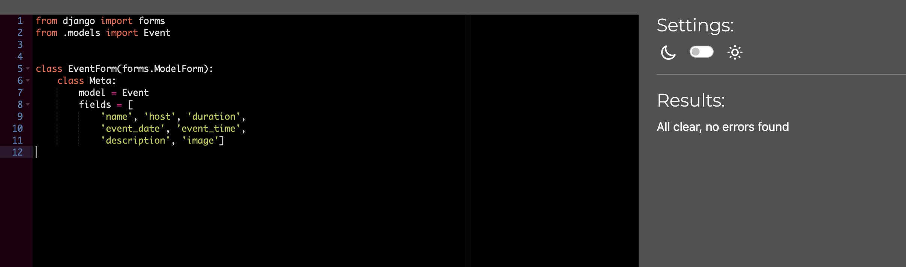

# Testing
- [Testing](#testing)
  - [Code Validation](#code-validation)
    - [HTML Testing](#html-testing)
    - [Python Testing](#python-testing)
    - [JavaScript Validation](#javascript-validation)
    - [CSS Testing](#css-testing)
    - [Browser Compatibility](#browser-compatibility)
    - [Responsiveness Test](#responsiveness-test)
    - [Fixed Bugs](#fixed-bugs)
    - [Unfixed Bugs](#unfixed-bugs)

## Code Validation

[Back to top](#testing)
### HTML Testing

I used [HTML W3C Validator](https://validator.w3.org) to validate all of my HTML files.

| HTML Source Code/Page | Errors | Warnings |
| ---- | ------ | -------- |
| Home | 0 | 0 |
| All Books (including filtering and sorting) | 0 | 0 |
| Book Detail | 0 | 0 |
| Register | 0 | 0 |
| Log In | 0 | 0 |
| Logout| 0 | 0 |
| Profile | 0 | 0 |
| Product Management | 0 | 0 |
| Edit Product | 0 | 0 |
| Our Team | 0 | 0 |
| Team Management | 0 | 0 |
| Edit Team | 0 | 0 |
| Our Events | 0 | 0 |
| Event Management | 0 | 0 |
| Edit Event | 0 | 0 |
| Order History | 0 | 0 |
| Bag - Empty | 0 | 0 |
| Bag - Products | 0 | 0 |
| Checkout | 0 | 0 |
| Admin Panel (including all categories and templates) | 0 |  |
| Get in Touch | 0 | 0 |

### Python Testing
[CI Python Linter](https://pep8ci.herokuapp.com/#) was used to validate the Python files.

| Feature               | admin                                       | forms                                       | models                                      | urls                                        | views                                       | extra                                      |
|-----------------------|---------------------------------------------|---------------------------------------------|---------------------------------------------|---------------------------------------------|---------------------------------------------|--------------------------------------------|
| Bag                   | n/a                                         | n/a                                         | n/a                                         | none  | none  | n/a |
| Checkout              | none  | none  | none  | none  | none  | none , none , none  |
| Contact               | n/a                                         | none  | n/a                                         | none  | none  | n/a                                        |
| Events                | none  | none  | none  | none  | none  | n/a                                        |
| Home                  | n/a                                         | n/a                                         | n/a                                         | none  | none  | n/a                                        |
| Indie Book Emporium  | n/a                                         | n/a                                         | n/a                                         | none  | n/a                                         |  |
| Products              | none  | none  | none  | none  | none  | none  |
| Profile               | n/a                                         | none  | none  | none  | none  | n/a                                        |
| Team                  | none  | none  | none  | none  | none  | n/a                                        |

[Back to top](#testing)

### JavaScript Validation

[JSHint](https://jshint.com/) was used to validate the JavaScript code.

| Page | Screenshot | Errors | Warnings |
|---------|----------|----------|-----------|
| Bag - Quantity Update/Remove Script |  | none | none |
| Checkout - Stripe Script |  | none | none |
| Products - Quantity Input Script |  | none  | none |

[Back to top](#testing)
### CSS Testing
[W3C CSS Validator](https://jigsaw.w3.org/css-validator/) was used to validate my CSS files.
Both base.css and checkout.css files passed. 

#### Browser Compatibility

- Safari 16.4.1
- Chrome 120.0.6099.199
- Firefox 122.0

#### Devices

- iPhone SE
- iPhone XR
- iPhone S2 Pro
- iPhone SE14 Pro Max
- Pixel 7
- Samsung Galaxy S8+
- Samsung Galaxy S20 Ultra
- Ipad Mini
- Ipad Pro
- Ipad Air
- Surface Pro 7
- Surface Duo
- Galaxy Fold
- Samsung Galaxy A51/71
- Nest Hub Max
- Nest Hub
- iPhone 4
- iPhone 6/7/8

## Fixed Bugs

1. Mismatched Checkout Forms: Initially, the checkout forms did not align with the order model, resulting in errors. Specifically, the form included a postcode field that was absent in the order class.
1. Category Model Misspelling: The category model encountered issues due to a misspelling in its implementation.
1. Event Form Image Rendering: The event form model failed to render images to the template. This occurred because although the form's enctype was set to multipart/form-data, I overlooked adding request.FILES in the view. Consequently, the absence of this caused a 200 response without highlighting the error.
1. Static Files Deployment Error: A deployment error arose when attempting to deploy static files to the AWS S3 bucket. This was traced back to a user not being created during the bucket creation process.
1. Heroku Deployment Issue: Deployment to Heroku faced obstacles due to a configuration error. The Heroku URL in the allowed hosts contained 'https://', which needed removal to function correctly.
1. Stripe Webhook Error: The Stripe webhook encountered a 400 HTTP error, stemming from incorrect email functionality setup for registration and order confirmation. Addressing this required updating the Python version to 3.11.9, along with configuring the runtime.txt file accordingly. Additionally, setting ACCOUNT_EMAIL_VERIFICATION to 'mandatory' resolved the error at the webhook endpoint and restored email functionality for the site.